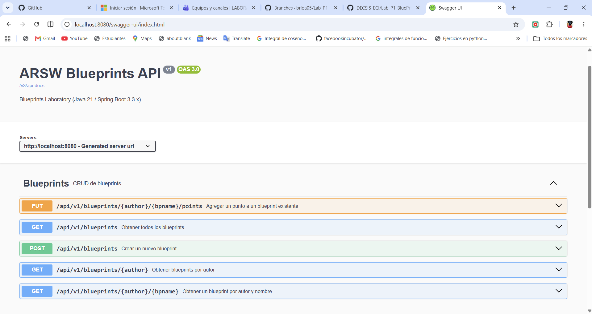
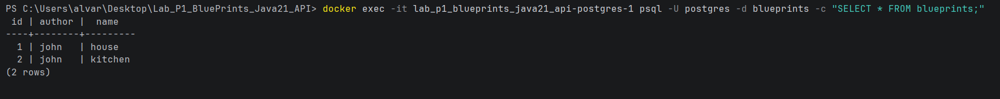
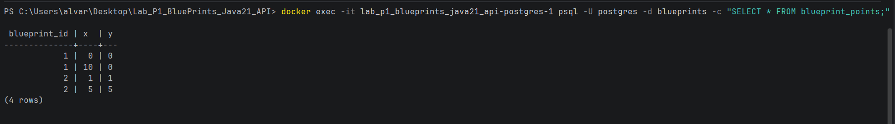
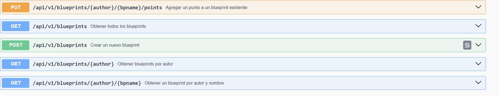
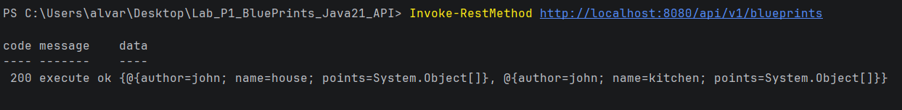

# Laboratorio #4 – REST API Blueprints
## Escuela Colombiana de Ingeniería – Arquitecturas de Software
**Estudiante:** Brayan Loaiza  
**Repositorio:** https://github.com/brloa05/Lab_P1_BluePrints_Java21_API_brayan_loaiza

---

## Requisitos previos

- Java 21
- Maven 3.9+
- Docker Desktop

---

## Ejecución del proyecto

### Con persistencia en memoria (por defecto)
```bash
mvn clean install
mvn spring-boot:run
```

### Con persistencia en PostgreSQL
```bash
# 1. Levantar la base de datos
docker compose up -d

# 2. Ejecutar la app con perfil postgres
mvn spring-boot:run "-Dspring-boot.run.profiles=postgres"
```

### Con filtros de puntos
```bash
# RedundancyFilter: elimina puntos duplicados consecutivos
mvn spring-boot:run "-Dspring-boot.run.profiles=postgres,redundancy"

# UndersamplingFilter: conserva 1 de cada 2 puntos
mvn spring-boot:run "-Dspring-boot.run.profiles=postgres,undersampling"
```

---

## Arquitectura

El proyecto sigue una arquitectura estrictamente por capas:

```
Controller → Service → Persistence
                ↓
             Filter  (solo en GET /{author}/{bpname})
```

```
src/main/java/edu/eci/arsw/blueprints
  ├── model/        → Blueprint, Point, ApiResponse<T>
  ├── persistence/  → Interfaz BlueprintPersistence
  │    ├── InMemoryBlueprintPersistence  (perfil: !postgres)
  │    ├── PostgresBlueprintPersistence  (perfil: postgres)
  │    └── BlueprintJpaRepository        (Spring Data JPA)
  ├── services/     → BlueprintsServices (orquestación)
  ├── filters/      → IdentityFilter / RedundancyFilter / UndersamplingFilter
  ├── controllers/  → BlueprintsAPIController
  └── config/       → OpenApiConfig
```

---

## Configuración PostgreSQL

La base de datos se levanta con Docker usando `docker-compose.yml`:

```yaml
services:
  postgres:
    image: postgres:16
    environment:
      POSTGRES_DB: blueprints
      POSTGRES_USER: postgres
      POSTGRES_PASSWORD: postgres
    ports:
      - "5432:5432"
```

Hibernate crea las tablas automáticamente con `ddl-auto=update`:

- **blueprints** — almacena autor, nombre e id autogenerado
- **blueprint_points** — almacena los puntos asociados a cada blueprint

---

## API REST

Ruta base: `/api/v1/blueprints`

Todas las respuestas usan el wrapper `ApiResponse<T>`:

```json
{
  "code": 200,
  "message": "execute ok",
  "data": { ... }
}
```

### Endpoints

| Método | Ruta | Descripción | Códigos HTTP |
|--------|------|-------------|--------------|
| GET | `/api/v1/blueprints` | Obtener todos los blueprints | 200 |
| GET | `/api/v1/blueprints/{author}` | Blueprints por autor | 200, 404 |
| GET | `/api/v1/blueprints/{author}/{bpname}` | Blueprint específico (aplica filtro) | 200, 404 |
| POST | `/api/v1/blueprints` | Crear blueprint | 201, 400, 403 |
| PUT | `/api/v1/blueprints/{author}/{bpname}/points` | Agregar punto | 202, 404 |

### Ejemplos de uso (PowerShell)

```powershell
# Obtener todos
Invoke-RestMethod http://localhost:8080/api/v1/blueprints

# Obtener por autor
Invoke-RestMethod http://localhost:8080/api/v1/blueprints/john

# Obtener blueprint específico
Invoke-RestMethod http://localhost:8080/api/v1/blueprints/john/house

# Crear blueprint
Invoke-RestMethod http://localhost:8080/api/v1/blueprints `
  -Method Post -ContentType 'application/json' `
  -Body '{"author":"john","name":"house","points":[{"x":0,"y":0},{"x":10,"y":0}]}'

# Agregar punto
Invoke-RestMethod http://localhost:8080/api/v1/blueprints/john/house/points `
  -Method Put -ContentType 'application/json' `
  -Body '{"x":5,"y":5}'
```

---

## OpenAPI / Swagger

Con la aplicación corriendo, la documentación está disponible en:

- **Swagger UI:** http://localhost:8080/swagger-ui.html
- **OpenAPI JSON:** http://localhost:8080/v3/api-docs

Todos los endpoints están anotados con `@Operation` y `@ApiResponse` de springdoc-openapi.

### Evidencia Swagger UI

La interfaz expone los 5 endpoints documentados con sus descripciones y métodos HTTP:



---

## Evidencia base de datos PostgreSQL

Consulta los datos directamente en el contenedor:

```bash
docker exec -it lab_p1_blueprints_java21_api-postgres-1 psql -U postgres -d blueprints -c "SELECT * FROM blueprints;"
docker exec -it lab_p1_blueprints_java21_api-postgres-1 psql -U postgres -d blueprints -c "SELECT * FROM blueprint_points;"
```

Tabla `blueprints` — almacena autor y nombre de cada blueprint:



Tabla `blueprint_points` — almacena los puntos asociados a cada blueprint por `blueprint_id`:



---

## Buenas prácticas aplicadas

### 1. Versionamiento de API
La ruta base `/api/v1/blueprints` permite evolucionar la API en el futuro (v2, v3) sin romper clientes existentes.

### 2. Wrapper de respuesta uniforme `ApiResponse<T>`
Todas las respuestas tienen la misma estructura (`code`, `message`, `data`), lo que facilita el manejo en el cliente sin importar el endpoint consultado.

### 3. Códigos HTTP semánticos
| Situación | Código |
|-----------|--------|
| Consulta exitosa | 200 OK |
| Recurso creado | 201 Created |
| Actualización aceptada | 202 Accepted |
| Datos inválidos | 400 Bad Request |
| Recurso duplicado | 403 Forbidden |
| Recurso no encontrado | 404 Not Found |

### 4. Separación de perfiles de Spring
Cada implementación de persistencia y filtro está asociada a un perfil de Spring, permitiendo cambiar el comportamiento de la aplicación sin modificar código:

| Perfil | Efecto |
|--------|--------|
| *(ninguno)* | Persistencia en memoria, sin filtro |
| `postgres` | Persistencia en PostgreSQL |
| `redundancy` | Activa RedundancyFilter |
| `undersampling` | Activa UndersamplingFilter |

### 5. Filtros de puntos
Los filtros se aplican únicamente al consultar un blueprint individual (`GET /{author}/{bpname}`), sin afectar los listados. Implementan la interfaz `BlueprintsFilter` y se activan con perfiles de Spring, respetando el principio abierto/cerrado.

---

## Criterios de evaluación

| Criterio | Peso |
|----------|------|
| Diseño de API (versionamiento, DTOs, ApiResponse) | 25% |
| Migración a PostgreSQL | 25% |
| Uso correcto de códigos HTTP y control de errores | 20% |
| Documentación con OpenAPI/Swagger + README | 15% |
| Pruebas básicas | 15% |

---

## Bonus: Imagen de contenedor con Docker

El proyecto incluye un `Dockerfile` multi-stage que construye y empaqueta la aplicación como imagen de contenedor.

### Construir y ejecutar la imagen

```bash
# Construir la imagen
docker build -t blueprints-api .

# Ejecutar solo la API (requiere PostgreSQL corriendo aparte)
docker run -p 8080:8080 blueprints-api

# Ejecutar API + PostgreSQL juntos con docker compose
docker compose up -d
```

### Dockerfile (multi-stage)

```dockerfile
FROM maven:3.9-eclipse-temurin-21 AS build
WORKDIR /app
COPY pom.xml .
RUN mvn -B dependency:go-offline
COPY src ./src
RUN mvn -B -DskipTests package

FROM eclipse-temurin:21-jre
WORKDIR /app
COPY --from=build /app/target/*.jar ./app.jar
EXPOSE 8080
ENTRYPOINT ["java","-jar","/app/app.jar"]
```

La imagen de build usa Maven + JDK 21 para compilar, y la imagen final usa solo el JRE 21, reduciendo el tamaño del contenedor resultante.

---

## Bonus: Métricas con Spring Boot Actuator

Spring Boot Actuator expone endpoints automáticos para monitorear el estado y las métricas de la aplicación en tiempo real, sin escribir código adicional.

### Endpoints disponibles

| Endpoint | Descripción |
|----------|-------------|
| `http://localhost:8080/actuator/health` | Estado de la app y conexión a la BD |
| `http://localhost:8080/actuator/metrics` | Lista de métricas disponibles (CPU, memoria, HTTP) |
| `http://localhost:8080/actuator/info` | Información general del proyecto |

### Ejemplo de respuesta `/actuator/health`

```json
{
  "status": "UP",
  "components": {
    "db": { "status": "UP" },
    "diskSpace": { "status": "UP" }
  }
}
```

### Ejemplo de respuesta `/actuator/info`

```json
{
  "app": {
    "nombre": "Blueprints REST API",
    "version": "1.0.0",
    "descripcion": "API REST para gestion de blueprints - Lab #4 ARSW",
    "estudiante": "Brayan Loaiza",
    "tecnologias": "Java 21, Spring Boot 3.3.x, PostgreSQL, Docker"
  }
}
```
